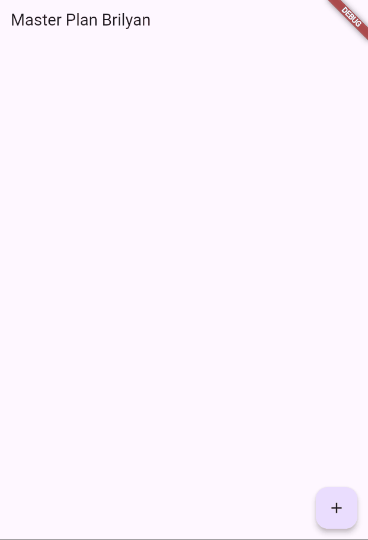
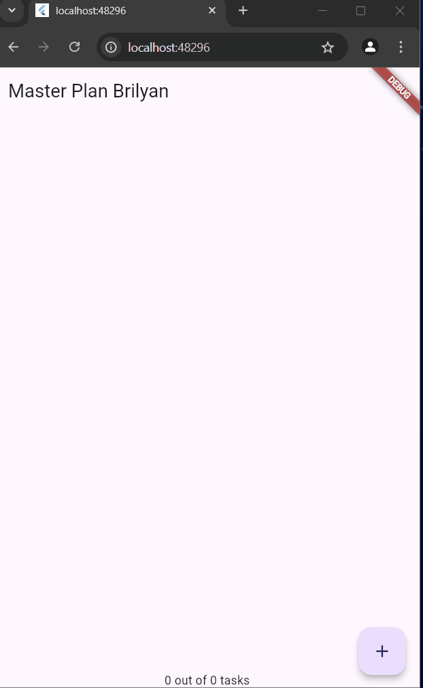

# Praktikum 10 Dasar State Management 
### Brilyan Satria Wahyuda
### TI-3H
### 2241720019
## Praktikum 1

1. Selesaikan langkah-langkah praktikum tersebut, lalu dokumentasikan berupa GIF hasil akhir praktikum beserta penjelasannya di file README.md! Jika Anda menemukan ada yang error atau tidak berjalan dengan baik, silakan diperbaiki.
   
2. Jelaskan maksud dari langkah 4 pada praktikum tersebut! Mengapa dilakukan demikian?

    <p>Dibuat data_layer.dart yang bertujuan untuk export dua model plan.dart dan task.dart, hal ini agar tidak terlalu banyak import pada file lain. Cukup impor data_layer saja</p>
3. Mengapa perlu variabel plan di langkah 6 pada praktikum tersebut? Mengapa dibuat konstanta ?
    <p>Variabel plan digunakan untuk menyimpan daftar task yang akan dikelola. Sebagai instance dari Plan, variabel ini bisa memungkinkan kita mengakses dan mengubah daftar tugas. </p>

4. Lakukan capture hasil dari Langkah 9 berupa GIF, kemudian jelaskan apa yang telah Anda buat!


    <p>Aplikasi menampilkan daftar tugas atau sebuah to-do list dengan masing-masing item berupa Checkbox dan TextFormField. Checkbox yang berfungsi untuk penanda apakah tugas sudah selesai, sedangkan TextFormField memungkinkan pengguna untuk mengubah deskripsi tugas.</p>

5. Apa kegunaan method pada Langkah 11 dan 13 dalam lifecyle state ?
    <p>
- initState(): Menginisialisasi state saat widget pertama kali dibuat. initState digunakan untuk membuat ScrollController dan menambahkan listener yang akan menutup keyboard ketika pengguna melakukan scroll.
- dispose(): Membersihkan resource ketika widget tidak lagi digunakan. dispose akan membuang ScrollController saat widget PlanScreen dihancurkan, sehingga mencegah memory leak.
</p>

## Praktikum 2
1. Selesaikan langkah-langkah praktikum tersebut, lalu dokumentasikan berupa GIF hasil akhir praktikum beserta penjelasannya di file README.md! Jika Anda menemukan ada yang error atau tidak berjalan dengan baik, silakan diperbaiki sesuai dengan tujuan aplikasi tersebut dibuat.
2. Jelaskan mana yang dimaksud InheritedWidget pada langkah 1 tersebut! Mengapa yang digunakan InheritedNotifier?
   ``` return context .dependOnInheritedWidgetOfExactType<PlanProvider>()!.notifier; ```
   <p>Inherited widget merupakan widgetr dasar yang bisa digunakan datanya oleh widget bawahnya. Menggunakan InheritedNotifier untuk listen ke perubahan pada notifier. perubahan pada objek plan akan diteruskan ke seluruh widget yang depend padanya dan pada 
   akhirnya memperbarui UI</p>

3. Jelaskan maksud dari method di langkah 3 pada praktikum tersebut! Mengapa dilakukan demikian?
   <p> 
   <br>- completedCount: Menghitung jumlah task yang statusnya complete yang bernilai true. <br>
- completenessMessage: Menghasilkan string yang menunjukkan progres dalam format "X out of Y tasks," di mana X adalah jumlah task yang selesai, dan Y adalah total task. </p>

4. Lakukan capture hasil dari Langkah 9 berupa GIF, kemudian jelaskan apa yang telah Anda buat!
5. 
<p>Menampilkan daftar tugas atau sebuah to-do list yang sama seperti praktikum sebelumnya, namun terdapat tambahan berupa method count untuk mengetahui banyaknya task yang telah diselesaikan atau dicentang.</p>

## Praktikum 3